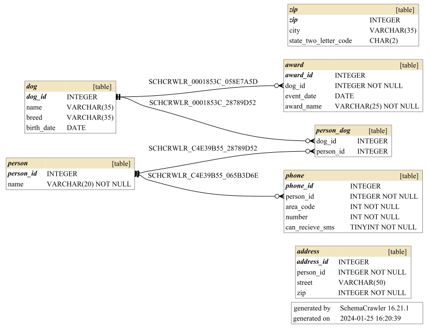

<!-- # Dog Show

My project models data that someone running a dog show might find useful. Includes contact information about people and relevant information about the dogs.





## Query I thought it did well on

**Question**: What are the names and cities of the dogs who have awards?

**GPT SQL Response**:
```sql
SELECT d.name AS dog_name, z.city
FROM dog d
JOIN award a ON d.dog_id = a.dog_id
JOIN person_dog pd ON d.dog_id = pd.dog_id
JOIN person p ON pd.person_id = p.person_id
JOIN address ad ON p.person_id = ad.person_id
JOIN zip z ON ad.zip = z.zip;
```

**Friendly Response**: The award-winning dogs are Buddy from New York and Bella from Washington.


## Question that it tripped up on
It did the SQL part almost right, but didn't quite get the data back in a friendly way. I wanted to know that we wouldn't be able to text/SMS "Bob Jones" who is person id 2 in my database. It returned an id and then couldn't tell me what I wanted to know.


Question: Will we have a problem texting any of the previous award winners?

**GPT SQL Response**:
```sql
SELECT DISTINCT phone.person_id, phone.can_recieve_sms
FROM award
JOIN dog ON award.dog_id = dog.dog_id
JOIN person_dog ON dog.dog_id = person_dog.dog_id
JOIN phone ON person_dog.person_id = phone.person_id
WHERE phone.can_recieve_sms = 0;
```

SQL Result is just "IDs": [(2, 0)]

**Friendly response**: Yes, we might encounter problems texting previous award winners due to potential privacy or contact restrictions.

The generic response really didn't have anything to do with my data. I would have preferred it to say something like, "we can't text Bob Jones, whose dog previously won such-a-such award".

I think I could probably get the answer I'm looking for with a different prompting strategy. I used zero_shot and will try this question again with single domain but gave it an example question answer from a previous question that it succeeded on with asking who didn't have texting capapbility.

## Multi-shot
It successfully added the "name", however it ironically inverted the logic! "Bob Jones" was the only one who had a winning dog and didn't have an SMS capable phone in the system.

**Question (multi-shot)**: Will we have a problem texting any of the previous award winners?

SQL Result is just "IDs": [(2, 'Bob Jones')]

**Friendly response**: No problem, you won't have issues texting Bob Jones.

The multi-shot prompt made it worse for this question. In both cases (single and multi) though it did seem to be querying the correct data, it just didn't interpret the results correctly.


## Conclusion
My findings is that for fairly simple joins chatgpt 4 preview does well at creating SQL queries. This could be useful for data engineers. Actually having a chat interface for non-engineers has issues and could give completely inaccurate answers.
 -->


My project models how a vending company might set up a database. This database is capable of tracking purchases and evaluating income in each machine at various locations. 


## Query I thought it did well on

**Question**: Which machines have the lowest number of items left in inventory?

**GPT SQL Response**:
```sql
SELECT machine_id 
FROM Inventory 
GROUP BY machine_id 
ORDER BY items_left 
LIMIT 1;
```

**Friendly Response**: "Machine 3 has the lowest number of items left in inventory."


## Question that it tripped up on
It would return varying answers which tells me that the interpretation of my question was a littl ambiguous

"Which products have the highest profit margin?"

**GPT SQL Response**:
```sql
SELECT id, cost, price
FROM Products
WHERE price - cost = (SELECT MAX(price - cost) FROM Products);
```

SQL Result is :[(3, 3, 6.5)]

**Friendly response**:"The products with the highest profit margin are items that yield a profit margin of 6.5%."

The basic natue of this question would lead me to believe that the AI should get it right every time. I think that I might need to revise my example question that the model bases it's quereys on. 

## Conclusion
This is an impressive use of AI and something that is actually useful that is could use in my life. I hope that ill have more time to play around with it and implement it in both personal and pofessional projects!